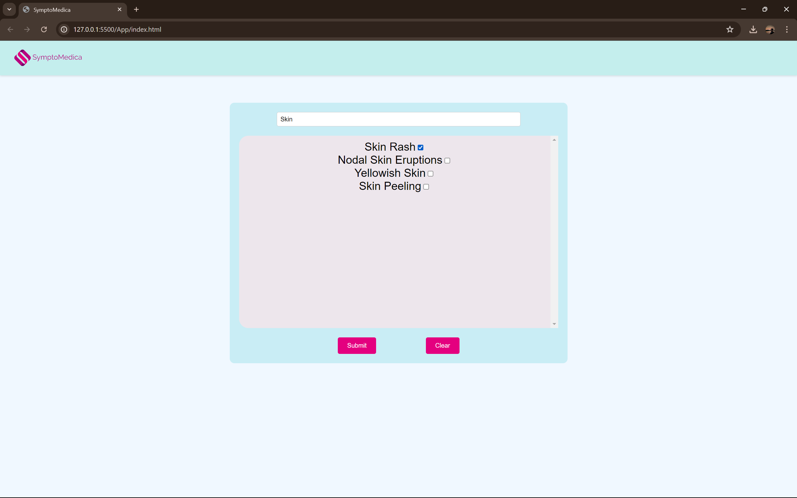

# SymptoMedica

SymptoMedica is a web application that predicts diseases based on input symptoms and provides detailed information about the predicted disease, including description, precautions, medications, diet, and workout recommendations. The backend is built using Flask, and the frontend is created using HTML, CSS, and JavaScript.

## Table of Contents

- [Installation](#installation)
- [Usage](#usage)
- [Project Structure](#project-structure)
- [API Endpoints](#api-endpoints)
- [Data Files](#data-files)

## Installation

1. Clone the repository:
   ```bash
   git clone https://github.com/MrProgrammerr/SymptoMedica
   cd SymptoMedica
   ```

2. Create a virtual environment and activate it:
   ```bash
   python -m venv venv
   source venv/bin/activate   # On Windows use `venv\Scripts\activate`
   ```

3. Install the required dependencies:
   ```bash
   pip install -r requirements.txt
   ```

4. Run the Flask application:
   ```bash
   python app.py
   ```

5. Open your browser and navigate to `http://127.0.0.1:5000`.

## Usage

1. Enter symptoms in the search box on the homepage.
2. Select symptoms from the dynamically generated list.
3. Click the "Submit" button to get the predicted disease and its details.
4. The results will be displayed in the response container.

## Project Structure

```
symptomedica/
│
├── Data/
│   ├── description.csv
│   ├── diets.csv
│   ├── medications.csv
│   ├── precautions_df.csv
│   ├── symptoms_df.csv
│   ├── workout_df.csv
│   ├── diseases_dict.pkl
│   └── symptoms_dict.pkl
│
├── templates/
│   └── index.html
│
├── static/
│   ├── styles.css
│   ├── script.js
│   └── src/
│       └── logo.png
│
├── app.py
├── helper.py
├── requirements.txt
└── README.md
```

## API Endpoints

### `/process` [POST]

- **Description**: Predicts disease based on input symptoms and returns detailed information.
- **Request Body**: JSON array of strings representing symptoms.
  ```json
  ["fever", "cough", "headache"]
  ```
- **Response**: JSON object with predicted disease and details.
  ```json
  {
    "disease": "Common Cold",
    "desc": "A viral infection of the nose and throat.",
    "pre": "Rest, Drink Fluids, Avoid Close Contact",
    "med": "Paracetamol, Ibuprofen",
    "diet": "Fruits, Vegetables, Soup",
    "wrkout": "Light Yoga, Stretching"
  }
  ```

## Data Files

- **`description.csv`**: Contains disease descriptions.
- **`diets.csv`**: Contains diet recommendations for diseases.
- **`medications.csv`**: Contains medication information for diseases.
- **`precautions_df.csv`**: Contains precautions for diseases.
- **`symptoms_df.csv`**: Contains symptoms data.
- **`workout_df.csv`**: Contains workout recommendations for diseases.
- **`diseases_dict.pkl`**: Pickle file mapping disease classes to disease names.
- **`symptoms_dict.pkl`**: Pickle file mapping symptoms to indices.

## Screenshots

<<<<<<< HEAD
### Landing


### Search Symptoms


### Check The Box


### Click Submit

=======
[See Recording](./rec.mp4)
>>>>>>> dc64b584166b483447c0e995903a7f4ed794abba
